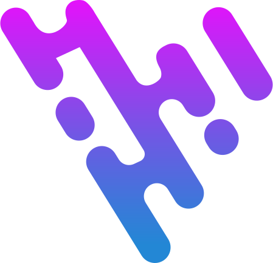

  

<h1 align="center">
  <a href="https://virgoui.dev/" target="_blank" align="center">
    Virgo
  </a>
</h1>

<b>Offering a collection of reusable components and a unique control for enhanced customization.</b>

## Features ✨

- **Unstyled**: Virgo is completely unstyled, so you can style it however you like. CSS-framework independent. We provide a default configuration what based on UnoCSS.
- **Accessible**: Virgo is built with accessibility in mind, so you can be sure that your app is usable by everyone.
- **Global Configuration**: Customization is effortlessly simple, but it's not just about the looks. Virgo provides global configuration for control over everything.
- **Tree Shaking**: Virgo is tree-shakable, so you only bundle the components you use.

## Installation 🛠️

Please refer to the [docs](https://virgoui.dev/guide/getting-started/installation.html)

## Lot of thanks

- [VueUse](https://github.com/vueuse/vueuse) - virgo depends on it
- [Floating UI](https://github.com/floating-ui/floating-ui) - virgo depends on it
- [Vuetify](https://github.com/vuetifyjs/vuetify) - Inspiration
